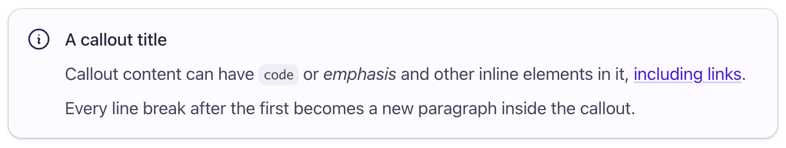
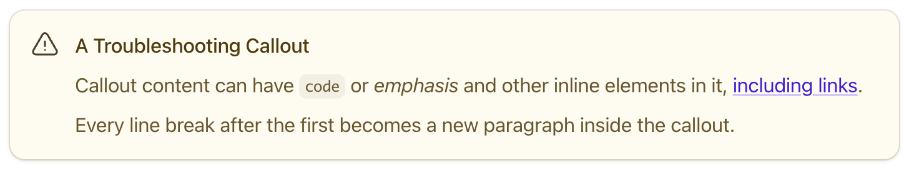

# Writing style guide

Welcome to the Buildkite writing style guide.

These guidelines provide details about the language and words used to write the Buildkite docs, as well as details about its writing style and format.
If something isn't included in this guide, see the [Google developer documentation style guide](https://developers.google.com/style), followed by the [Microsoft Style Guide](https://docs.microsoft.com/en-us/style-guide/welcome/).

For details about the Markdown syntax used to render your writing as well as the Buildkite docs' file structure, as well as details on working with the site, and using screenshots, refer to the [Markdown syntax style guide](markdown-syntax-style.md).

Table of contents:

- [Language](#language)
- [Style and formatting](#style-and-formatting)

## Language

This section covers everything related to the language, words, and formatting used in Buildkite documentation (including the website, to some extent).

### English flavor

Use US English. As a highly multi-national team, here is the list of the most notable differences between [Australian, American (US), and British English](https://blog.e2language.com/australian-english-vs-american-english-vs-british-english/) English to watch out for.

### Dictionary

Buildkite's first-call dictionary is [Merriam Webster](https://www.merriam-webster.com/) for US English. This is not a single source of truth, just a good starting/reference point.

> [!NOTE]
> The Buildkite docs build process uses [Vale](https://github.com/apps/vale-linter), a [linter](/README.md#linting) with a file that contains a [custom list of words](/vale/styles/vocab.txt) that may confuse the spellchecker, [filename linter](https://ls-lint.org/1.x/getting-started/introduction.html), and a [Markdown linter](https://github.com/DavidAnson/markdownlint).

### Commas

Keep it clean and uncluttered. Use commas for clarity, not decoration.

Absolutely yes, yes, and yes—use serial commas _when required_—typically when listing items in a sentence.

Serial commas are also known as 'Oxford commas'.

**Why?** Note the difference between these two sentences:

1. _I went to the shop with my parents, Fred and Wilma._
1. _I went to the shop with my parents, Fred, and Wilma._

How many people are being referred to in each of these sentences?

- In sentence 1, in addition to me, there are two more people involved: Fred and Wilma, both of whom happen to be my parents.
- In sentence 2, in addition to me, there are four more people involved: my parents (whose names are not mentioned), as well as Fred, and Wilma.

Therefore, use serial commas to distinguish individual items in a list from those which are not.

### Plain English

Aim to adopt and implement [_plain English language_](https://clickhelp.com/clickhelp-technical-writing-blog/basics-of-plain-language-in-technical-documentation/) in your writing. Avoid complex, niche or obscure jargon that many readers would find off-putting and distracting, because such jargon is unclear. Instead, use more conventional terms that most readers will understand upon reading your writing for the first time. This doesn't mean you cannot use technical terms—just as long as they are terms that most of your target audience will understand.

### Active/passive voice

Whenever possible, use active voice, which is generally clearer and simpler.

Conventional/natural English sentence word order is subject > verb > object, where the subject or object could be clauses in their own right.

#### Active voice

_Active voice_ typically follows this natural word order and is generally easier for readers to follow. More specifically, with active voice, the subject comes before the main verb/action in a sentence.

Examples:

- _The XYZ window_ (subject) _displays_ (verb) _the result._ (object)

  That is:

  _The XYZ window displays the result._

- _Select "Settings" > "YAML Migration"_ (subject clause) _to open_ (action) _the YAML migration settings._ (object)

  That is:

  _Select "Settings" > "YAML Migration" to open the YAML migration settings._

#### Passive voice

Passive voice is when the object of a sentence comes before its (main) verb/action.

Following on from the examples above (written in passive voice):

Examples:

- _The result_ (object) _is displayed_ (verb) _by the XYZ window._ (subject clause)

  That is:

  _The result is displayed by the XYZ window._

- _The YAML migration settings_ (object) _is opened_ (action) _by selecting "Settings" > "YAML Migration"._ (subject clause)

  That is:

  _The YAML migration settings is opened by selecting "Settings" > "YAML Migration"._

  You could make this sentence sound a little more like it's in the active voice through a little rearrangement:

  _Open the YAML migration settings by selecting "Settings" > "YAML Migration"._

  However, the fully active voice version (above) is preferable for instructional step-by-step content like this.

#### Conclusion on active/passive voice usage

Aim to use active voice in instructional step-by-step content and avoid passive voice.

Passive voice is useful when you want to:

- Emphasize the object, for example when describing the consequence of an activity in the previous sentence. However, stick to active voice for such sentences unless the object requires emphasis.
- Be less accusatory on the reader (usually referred to in the 2nd person 'you'). For example, compare the less accusatory version of this passive voice sentence:

  _The system crashed when the red button was pressed (by you)._

  Versus its more active form:

  _The system crashed when you pressed the red button._

> [!TIP]
> While identifying active/passive voice usage can sometimes be tricky, as a general principle, if you find yourself writing "by _verb/action word_" within a lot of your sentences, try flipping the subject and object parts of these sentences around when re-writing them.

### Gender

Always use ‘they’, never use ‘he’ or ‘she’.
More info on writing about pronouns and in both the [Google developer documentation style guide](https://developers.google.com/style/pronouns#gender-neutral-pronouns) and [Microsoft Style Guide](https://learn.microsoft.com/en-us/style-guide/grammar/nouns-pronouns#pronouns-and-gender) on pronouns.

### Formality

The Buildkite Docs aims to be _semi-formal_, in that a balance is being struck between developing content that is too formal and distant, or too casual and flippant for the reader. Buildkite feels that a language tone which falls between these two opposites (semi-formal) would engage the reader more than a language tone at these two opposite ends. Hence, in the Buildkite Docs, you may often see acceptable usage of less formal word contractions such as "didn't" or "haven't" instead of "did not" or "have not", respectively.

This list summarizes word usage (or words and punctuation to avoid) in line with the _semi-formal_ tone of the Buildkite Docs:

- **We (as in Buildkite)**: Avoid using this pronoun (which also encompasses the pronoun "our") in the Buildkite Docs as these pronouns are inherently ambiguous, especially in standardized/formalized documentation. "We" does not necessarily mean Buildkite in all contexts. This pronoun's usage would be more suitable in content with a less formal tone—for example, friendlier, introductory content such as that of a tutorial, where you might begin a sentence or paragraph with "We recommend..." and where the context unambiguously indicates "we" as "Buildkite."
- **Exclamation marks**: Following on from "we" usage above, avoid using exclamation marks `!` for punctuation in standardized/formalized documentation unless the content suits it—that is, content with a less formal, friendlier, tone, such as introductory content or a tutorial. For example, "That's it! You've completed this tutorial."

### Glossary of notable terms and their spelling

| Word | Usage |
|---------------------------|----------------------------------------------------------------------------|
| API, SSO, SAML            | Always capitalized |
| Buildkite Agent/agent | When referring to the running process/piece of software as a whole |
| `buildkite-agent`         | When referring to the CLI tool, visually should be presented in a code block |
| Model Context Protocol    | Spell out as a proper noun, and in abbreviated form, MCP. This term is spelled as a proper noun in the official [MCP documentation](https://modelcontextprotocol.io/), as well as in the documentation sites of several other tools and products that implement MCP. |
| Premises                  | When using this word to refer to a specific location in the singular, use "premises" (for example, "on-premises") and not "premise"/"on-premise". A "premise" is a different English word synonymous with the word "condition". There are other unusual English nouns, where the singular form is the same as its plural form, such as "series". |
| Sign up/log in            | The action of signing up (that is, the verb form of these terms) |
| Signup/login              | When referring to a page that enables signing up or to the signup process (that is, the adjective or noun form of these terms) |
| Single sign-on            | In abbreviated form, SSO |
| Time out/timeout          | Time out is a verb, timeout is a noun or adjective |
| Two-factor authentication | In abbreviated form, 2FA |

### Specific word/term usage

#### Use "and" and not "&"

Avoid using ampersands ("&") for the word "and". Doing so sets a poor stylistic precedent. In the Buildkite Docs, "and" is spelled verbatim as "and", and inconsistencies in the way "and" is referred to in the docs impairs its overall readability.

#### And/or

Avoid this construct as it can be confusing to the reader. Often, "and" implies "or", and therefore you don't need to write both words as "and/or". For example, "You can view and edit your pipeline steps" also implies "or" for the "and".

If you feel that "and/or" between two items is required, use "or" between the items, followed by ", or both" after the 2nd item. For example, "This solution is useful when you need to get a build environment up and running quickly or you have limited resources to implement a hybrid architecture, or both."

### Common trip-ups

Linters cannot do all of the work for you, so please pay attention to the following cases:

- **Their/they’re/there, your/you’re:** [Check](https://www.dictionary.com/e/their-there-theyre/ ) if you’ve got the right one for your situation!
- **Affect/effect:** Affect is a verb, effect is a noun. When you affect something, you’re impacting or changing the thing. When you have an effect, it’s the outcome or result of a change.
- Be mindful of **hyphens**! Hyphens for compound adjectives, no hyphens in verbs: 'end-user documentation' vs. 'for the end user'.

## Style and formatting

This section covers the matters that go beyond language and provides guidelines for consistency in writing with a unified look.

### Consistency

Keep your writing consistent with itself and other docs. This means abbreviations, capitalization, hyphens, names of UI elements, etc.

### Headings

Use sentence case in all headings:

_The quick brown fox jumps over the lazy dog_

The standard case used in English prose. That is, only the first word is capitalized, except for proper nouns and other words which are generally capitalized by a more specific rule.

Do not create multi-sentence headings, or add full stops/periods or other punctuation at the end of a heading.

Also, in line with [Google's developer docs guidelines on heading/title formatting](https://developers.google.com/style/headings#heading-and-title-format), avoid using `code` items in headings, but if you do need to reference code items in a heading, do so without code formatting and [without grammatically inflecting the code items](https://developers.google.com/style/code-in-text#grammatical-treatment-of-code-elements).

Refer to [Headings in the Markdown syntax style guide](markdown-syntax-style.md#headings) for details on how to implement headings in Markdown.

### Product Names (and product features)

Only use Title Case (initial capital letters) for the name of the product (_product names_), and match the capital letter usage in product names as the organization who produces them would use them in their product names. Avoid using Title Case for _product features_, that is, when mentioning or describing them in documentation. Product features are treated as _common nouns_, not _Proper Nouns_. For example:

- 'Docker Compose overview' and not 'Docker Compose Overview' (where 'Docker Compose' is a product name)
- 'GitHub organization' and not 'GitHub Organization' (where 'organization' is a product feature)

> [!NOTE]
> Ensure brand capitalization is adhered to, for example, refer to GitHub as "GitHub", and not "Github" or "GITHUB".

### UI elements

UI elements should be formatted in bold. For example:

- To view your cluster's agent tokens, navigate to **Agents**, select your cluster, then select the **Agent Tokens** option.

> [!NOTE]
> Match the capitalization used in the Buildkite interface, even if title (or any other) case has been used for product features.

Refer to [UI elements in the Markdown syntax style guide](markdown-syntax-style.md#ui-elements) for details on how to write and present UI elements in the Buildkite docs.

### Key terms and emphasis

Key terms or any words you want to emphasize should be formatted in italics. For example:

- A Buildkite agent requires an _agent token_ to connect to Buildkite and register for work.
- This configuration is _not_ required if your registry is publicly accessible.

> [!NOTE]
> Use italicization for key terms sparingly—either near the top of a section of documentation, or the top of a page. In general, a key term only needs to be pointed out once in such a section of documentation and not every time it's used on a page.

Refer to [Key terms in the Markdown syntax style guide](markdown-syntax-style.md#key-terms-and-emphasis) for details on how to write and present key terms in the Buildkite docs.

### Lists (bullet lists and numbered steps)

In general:

- Use bullet lists when presenting an unordered list of individual items.
- Use numbered steps when presenting a sequence of instructions/steps that need to be followed.

See also what [Google](https://developers.google.com/style/lists) and [Microsoft](https://learn.microsoft.com/en-us/style-guide/scannable-content/lists) say about lists.

Capitalize the first word—no full stops at the end if it's not a full sentence. If it's a full sentence, give it a full stop/period. See also what [Google](https://developers.google.com/style/lists#capitalization-and-end-punctuation) and [Microsoft](https://learn.microsoft.com/en-us/style-guide/scannable-content/lists#punctuation) say about punctuation in list items.

Refer to [Lists in the Markdown syntax style guide](markdown-syntax-style.md#lists) for details on how to write and present lists in the Buildkite docs.

### Writing numbers

Write out numbers up to 10, then use digits—'58 bugs in this script and just two hours to fix them all!'
Long numbers use commas to separate thousands—'100,000,000.00'. When in doubt, see what [Google](https://developers.google.com/style/numbers) and [Microsoft](https://docs.microsoft.com/en-us/style-guide/numbers) say about numbers.

Avoid using numbers in page headings. Only use numbers less than 10 in section headings.
No restrictions on using numbers in the body of the text.

### Time and date

Use 24hr time with hours and minutes, but not seconds. Include timezone. For example, 17:00 AEST

More about this in the [Google developer documentation style guide](https://developers.google.com/style/dates-times).

### Spacing after the end of a sentence

Refer to [Spacing after the end of a sentence in the Markdown syntax style guide](markdown-syntax-style.md#spacing-after-the-end-of-a-sentence) for more details about this.

### Callouts

Callouts are also known as admonitions.

The Buildkite Docs uses two types of callouts—regular info callouts, which can also be used for notes, as well as troubleshooting callouts, which can also be used for warnings.

A regular info callout looks like this:

And a troubleshooting callout looks like this:

Refer to [Callouts in the Markdown syntax style guide](markdown-syntax-style.md#callouts) for details on how to write and present lists in the Buildkite docs.
